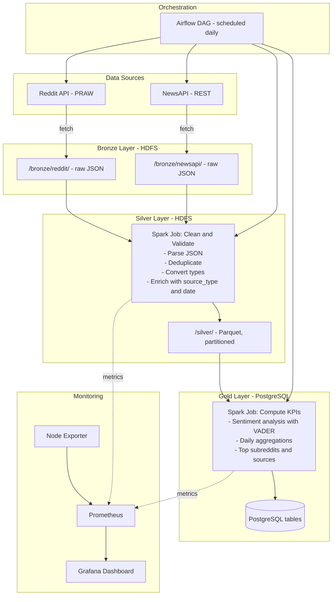

# Big Data Project - Reddit & News Sentiment Analysis Platform

This project implements a complete data lake and warehouse platform using the Medallion architecture (Bronze, Silver, Gold layers). The system ingests mixed data from Reddit and NewsAPI, performs automated transformations with quality validation, exposes business KPIs, and provides monitoring of operations across all layers.

## Project Subject

The goal is to build a sentiment analysis and trend monitoring platform that combines social media opinion (Reddit) with mainstream media coverage (NewsAPI). By processing and analyzing text data from both sources, the platform identifies sentiment trends, correlates public opinion with media coverage, and surfaces actionable insights through a dashboard.

## Data Sources

The project uses two complementary data sources to reach the required 5GB minimum while providing both structured and unstructured data.

### Reddit (via PRAW API)
- **Type**: Unstructured text (posts and comments) plus structured metadata
- **Metadata**: score, creation date, subreddit, author, number of comments
- **Access**: Free API via the PRAW Python library
- **Volume**: Continuous scraping over several weeks to reach 5GB or more
- **Justification**: Reddit provides rich, authentic user-generated text data ideal for sentiment analysis. The PRAW API is well-documented, handles rate limiting automatically, and allows both batch and real-time fetching.

### NewsAPI
- **Type**: Unstructured text (article titles, descriptions, content) plus structured metadata
- **Metadata**: source name, publication date, URL, author
- **Access**: Free tier REST API (100 requests per day, one month of history)
- **Volume**: Approximately 100 articles per day
- **Justification**: NewsAPI aggregates articles from thousands of sources, providing a broad view of media coverage. It complements Reddit by offering a more formal and editorial perspective, enabling interesting comparisons between public opinion and professional journalism.

Together, these sources satisfy the requirement for mixed data (structured and unstructured) and automated API-based ingestion.

## Architecture Overview (Medallion)

The platform follows the Medallion architecture with three distinct data layers.

**Bronze Layer (Raw Data)**
This layer stores data exactly as it is fetched from the APIs. No transformations are applied. Reddit data is saved as raw JSON lines, and NewsAPI responses are stored in their original JSON format. Data is partitioned by ingestion date in HDFS.

**Silver Layer (Cleaned and Indexed Data)**
This layer performs schema validation, type conversion, deduplication, and enrichment. For Reddit, we extract relevant fields such as title, body text, score, and subreddit. For NewsAPI, we extract title, description, content, and source. Null values are handled, duplicates are removed, and an additional column is added to indicate the source type. The cleaned data is stored in Parquet format for better query performance.

**Gold Layer (KPIs and Data Warehouse)**
This layer calculates business KPIs and stores them in PostgreSQL. Key operations include sentiment scoring using the VADER library, daily aggregation of sentiment averages, volume counting, and ranking of top subreddits and news sources. The results are structured as tables and made available for dashboarding and BI tools.

## Data Pipeline Diagram

The following diagram illustrates the complete data flow from ingestion to visualization.



## Technology Stack

| Component | Role | Rationale |
|-----------|------|-----------|
| HDFS | Storage for Bronze and Silver layers | Distributed file system suitable for large volumes of raw and intermediate data |
| Apache Spark | Data processing and transformation | Distributed processing engine with support for scaling across multiple workers |
| PostgreSQL | Data warehouse for Gold layer | Reliable relational database with native support for BI tools and SQL queries |
| Apache Airflow | Pipeline orchestration | Automates task scheduling, dependency management, and monitoring of ETL workflows |
| Prometheus | Metrics collection | Industry-standard tool for collecting and storing time-series metrics |
| Grafana | Visualization and dashboards | Connects directly to Prometheus for real-time monitoring dashboards |
| Node Exporter | System metrics export | Exposes host-level metrics (CPU, memory, disk) for Prometheus scraping |
| Docker Compose | Container orchestration | Ensures reproducibility, service isolation, and internal networking between components |

## Business KPIs (Gold Layer)

The following KPIs are computed from the cleaned data and stored in PostgreSQL:

| KPI | Description | Data Source |
|-----|-------------|-------------|
| Daily Sentiment Score | Average sentiment score per day per source type using VADER | Post and article text |
| Volume of Mentions | Count of posts and articles per day | Metadata timestamps |
| Top Subreddits | Ranking of subreddits by activity level | Subreddit field |
| Top News Sources | Ranking of media outlets by coverage volume | Source name field |
| 7-Day Sentiment Trend | Rolling average of sentiment to identify patterns | Daily sentiment aggregations |

## Configuration and Deployment

All configuration is managed through environment variables and a docker-compose file. No manual setup steps are required.

### Environment Variables (.env file)

```
REDDIT_CLIENT_ID=your_client_id
REDDIT_CLIENT_SECRET=your_client_secret
REDDIT_USERNAME=your_username
REDDIT_PASSWORD=your_password
NEWSAPI_KEY=your_api_key
POSTGRES_USER=admin
POSTGRES_PASSWORD=admin
POSTGRES_DB=kpis
AIRFLOW_UID=50000
```

### Makefile Commands

A Makefile is provided to simplify common operations:

- `make start` - Starts all Docker services in the background
- `make stop` - Stops all running containers
- `make check-sources` - Tests API connectivity for both Reddit and NewsAPI
- `make clean` - Removes all data from HDFS and PostgreSQL for a fresh start

### Quick Start

Clone the repository and launch the platform:

```bash
git clone https://github.com/youcisla/BigDataProject.git
cd BigDataProject
make start
make check-sources
```

Airflow is accessible at http://localhost:8080 and Grafana at http://localhost:3000.

## Project Structure

```
BigDataProject/
├── docker-compose.yml          # Defines all services
├── .env                        # Environment variables
├── Makefile                    # Automation commands
├── dags/
│   └── reddit_news_dag.py      # Airflow DAG definition
├── scripts/
│   ├── fetch_reddit.py         # Reddit ingestion script
│   ├── fetch_newsapi.py        # NewsAPI ingestion script
│   └── upload_to_hdfs.py       # Upload utility
├── jobs/
│   ├── silver_transform.py     # Spark cleaning job
│   └── gold_kpis.py            # Spark KPI computation job
├── sql/
│   └── schema.sql              # PostgreSQL table definitions
└── README.md
```

## Compliance with Project Requirements

| Requirement | Status | Implementation Notes |
|-------------|--------|----------------------|
| 5GB+ mixed data | Achieved | Continuous Reddit scraping over several weeks plus NewsAPI history |
| Structured + unstructured data | Covered | Metadata (structured) + text content (unstructured) |
| Automated API fetching | Implemented | PRAW for Reddit, requests for NewsAPI |
| No manual configuration | Ensured | Everything defined in .env and docker-compose.yml |
| Apache Spark (non-local) | Included | Spark cluster with workers running in Docker |
| Monitoring with Grafana | Integrated | Prometheus + Grafana + Node Exporter |
| Docker containerization | Complete | All services defined in docker-compose.yml |
