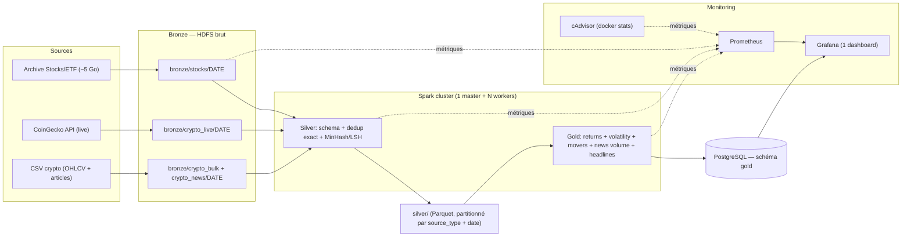

# Projet Big Data — Data Lake & Warehouse avec Monitoring

**Auteur :** Adam Jemaa  
**Promotion :** IPSSI 2026 — édition dataset simple  
**Sujet :** plateforme data lake + warehouse — Medallion Bronze/Silver/Gold, ≥5 Go de données mixtes, Spark non local sur cluster Docker, monitoring Grafana par couche, dashboard comparatif (TradingView Lightweight Charts + chord + ridgeline + radar + word cloud + bubble map) sur données OHLCV + headlines crypto.

---

## 1. Présentation

Plateforme data lake + warehouse suivant l'architecture Medallion (Bronze → Silver → Gold). Ingestion automatisée de données mixtes (structurées et non structurées) depuis une **archive US stocks/ETF OHLCV** + des **CSV crypto** (OHLCV + headlines) + l'**API live CoinGecko**. Transformations distribuées via Apache Spark sur cluster Docker (1 worker par défaut, scalable via `--scale`). KPIs financiers exposés dans PostgreSQL, supervisés via Grafana + Prometheus + cAdvisor.

Objectif métier : **veille financière** corrélant cours boursiers, retours quotidiens et volume de news crypto pour détecter mouvements anormaux.

---

## Flux global du pipeline



Les flèches pleines portent les données : Sources → Bronze HDFS → Spark Silver → Spark Gold → Postgres. Les flèches pointillées portent les métriques vers Prometheus, qui alimente Grafana.

---

## 2. Conformité au cahier des charges

| Exigence (docx) | Couverture | Localisation |
|---|---|---|
| Bronze / Silver / Gold | OK | `scripts/fetch_*.py` (Bronze) + `jobs/silver_transform.py` + `jobs/gold_kpis.py` |
| 5 Go+ données mixtes | OK | Archive US stocks/ETF OHLCV (~5 Go extraits) + headlines crypto |
| Structuré + non structuré | OK | OHLCV (structuré) + `headline` texte libre (non structuré) |
| Fetch automatisé via API | OK | `scripts/fetch_crypto_live.py` (CoinGecko, sans clé, cron-friendly) |
| Spark non local | OK | Cluster Docker : 1 master + N workers (défaut 1, scalable via `--scale`) |
| Workers logiques | OK | `docker compose up --scale spark-worker=N` |
| Aucune configuration manuelle | OK | `.env` + YAML + Makefile, aucun `.sh` |
| Monitoring Grafana | OK | `monitoring/grafana/dashboards/` (1 dashboard unifié) |
| Métriques par couche | OK | Bronze (records, durée), Silver (nulls, invalides, doublons exacts + approx), Gold (lignes écrites, durée) |
| Prometheus + métriques système | OK | `monitoring/prometheus.yml` + `cadvisor` (remplace Node Exporter) |
| PostgreSQL pour Gold | OK | Service `postgres` + `sql/gold_schema.sql` (6 tables) |
| HDFS | OK | Services `namenode` + `datanode` (apache/hadoop 3.4.1) |
| Docker Compose + Makefile | OK | `docker-compose.yml` + `Makefile` |

### Résultats du dernier run vérifié

Sous-ensemble de 60 tickers actions/ETF + 9 cryptos (le pipeline complet accepte les ~7000 tickers de l'archive) :

| Couche | Volume |
|---|---|
| Bronze | 262 367 records sur 4 partitions (`stocks`, `crypto_bulk`, `crypto_live`, `crypto_news`) |
| Silver | 241 533 records (311 doublons exacts, 20 523 quasi-doublons MinHash/LSH, 0 invalide) |
| Gold | 170 231 `daily_prices` · 170 163 `daily_returns` · 145 916 `top_movers` · 170 027 `rolling_volatility_7d` · 9 980 `news_volume_per_coin` · 18 000 `news_headlines` |

`make load` est idempotent : chaque table Gold est vidée (TRUNCATE) puis réécrite, donc relancer le job ne duplique rien et ne viole aucune clé primaire.

## 3. Sources de données

| Source | Type | Structuré | Non structuré | Partition Bronze |
|---|---|---|---|---|
| **US Stocks + ETF OHLCV** | Archive `*.us.txt` | ticker, date, open/high/low/close, volume | — | `bronze/stocks/` |
| **Crypto OHLCV (archive)** | CSV par coin | ticker, date, open/high/low/close | — | `bronze/crypto_bulk/` |
| **CoinGecko API** | REST live | ticker, date, OHLC | — | `bronze/crypto_live/` |
| **Crypto news headlines** | Colonne `articles` des CSV crypto | date, ticker, source | headline | `bronze/crypto_news/` |
| **News financières RSS** | Flux RSS (Yahoo Finance par symbole, CoinDesk, CoinTelegraph, Nasdaq) | date, ticker, url, publisher | headline | `bronze/news_rss/` |
| **Barres intraday** | Yahoo chart API | ticker, ts, interval, OHLCV | — | `bronze/intraday/` |

### Détail

- **Archive actions/ETF (Kaggle, borismarjanovic).** Historique quotidien OHLCV pour ~7000 actions et ETF US. ~5 Go une fois extrait, un fichier `*.us.txt` par ticker. Chargé par `scripts/fetch_stocks.py`.
  URL : https://www.kaggle.com/datasets/borismarjanovic/price-volume-data-for-all-us-stocks-etfs
- **CSV crypto (format CryptoDataDownload).** Un fichier par coin (`data/BTC.csv`, `data/ETH.csv`, …) avec les colonnes `begins_at, open_price, close_price, high_price, low_price, symbol, articles`. La colonne `articles` contient une liste de titres d'articles : `scripts/fetch_crypto.py` la décompose en enregistrements `crypto_news` distincts. C'est la source non structurée du projet.
- **CoinGecko API.** `scripts/fetch_crypto_live.py` appelle `/coins/{id}/ohlc` (free tier, sans clé, 10-30 appels/min) pour BTC, ETH, SOL, ADA, AVAX, LTC. Couvre l'exigence « fetch automatisé via API » et se planifie par cron.
- **News RSS (`scripts/fetch_news_rss.py`).** Deux familles de flux, sans clé API :
  - *Par symbole* — Yahoo Finance publie un flux RSS par ticker, donc la headline arrive déjà rattachée au symbole. C'est ce qui alimente « clic sur un symbole → ses news ».
  - *Marché* — CoinDesk, CoinTelegraph, Nasdaq. Chaque item est rattaché aux tickers cités dans le titre : alias pour les cryptos (`bitcoin` → BTC), et cash-tag obligatoire pour les actions (`$AAPL`), les symboles courts entrant sinon en collision avec des mots anglais.
  Le XML est parsé par `defusedxml` : un flux RSS est une entrée réseau non fiable, et le parseur stdlib accepte les attaques XXE et « billion laughs ».
- **Barres intraday (`scripts/fetch_intraday.py`).** L'archive Kaggle est *journalière uniquement* : aucune timeframe sous 1 jour n'est dérivable de ces données. Les barres 1m/5m/15m/1h viennent donc de l'API chart de Yahoo, qui plafonne l'historique par intervalle — 1m ≈ 7 jours, 5m/15m ≈ 60 jours, 1h ≈ 730 jours. Demander plus renvoie silencieusement moins, d'où le mapping explicite `INTERVAL_RANGE` dans le script.

### Justification du choix (option 11 du cahier des charges)

- **Mixte** : OHLCV (numérique) + headlines (texte libre) + flux API continu.
- **API-fetchable** : CoinGecko sans clé ni quota bloquant.
- **5 Go+ en un chargement** : l'archive actions/ETF atteint le volume exigé.
- **Analytiquement riche** : daily returns, rolling volatility, top movers, volume de news — des KPIs financiers plus rigoureux qu'un score de sentiment générique.

## 4. Architecture Medallion

### Bronze — données brutes

- Ingestion des archives (stocks/ETF, crypto, headlines) et du flux CoinGecko sans transformation.
- Stockage sur **HDFS** (`/data/bronze/{stocks,crypto_bulk,crypto_live,crypto_news}/{YYYY-MM-DD}/`).
- Partitionnement par date d'ingestion.
- Métriques : nombre de records écrits, durée d'ingestion, statut (succès/échec par lot).

### Silver — données nettoyées et indexées

- Lecture Bronze depuis HDFS, transformation via **Spark** distribué.
- Validation de schéma, conversion de types, parsing des timestamps.
- **Déduplication exacte** : hash SHA-256 sur `(source, external_id, ingested_at)`.
- **Déduplication approximative** : MinHash + LSH (datasketch) sur le champ `headline` (5-word shingles), seuil Jaccard 0.8.
- Enrichissement : colonne `source_type` (`stock_ohlcv` | `crypto_ohlcv` | `crypto_news`).
- Écriture en `partitionOverwriteMode=dynamic` : relancer une date ne détruit pas les autres.
- Stockage **Parquet** partitionné par `source_type` et date.
- Métriques : comptage nulls par colonne, records invalides, doublons exacts + approximatifs trouvés, durée transformation.

### Gold — KPIs et entrepôt

Lecture Silver, agrégations via Spark SQL :

- **Daily prices** : OHLCV par ticker par jour (dernier close par source).
- **Daily returns** : variation en % vs jour précédent, par ticker.
- **Top movers** : top 10 gainers + 10 losers par jour.
- **Rolling volatility 7d** : écart-type glissant sur 7 jours des retours, par ticker.
- **News volume per coin** : nombre de headlines par ticker par jour.

Chargement dans **PostgreSQL** (schéma `gold`, tables partitionnées par date).

Métriques : durée de calcul, lignes agrégées, lignes écrites en base.

---

## 5. Stack technique

| Composant | Technologie | Rôle |
|---|---|---|
| **Orchestration** | Makefile + cron | Bronze → Silver → Gold via `make demo` |
| **Traitement distribué** | Apache Spark (cluster Docker, 1 master + N workers) | Transformations Silver + Gold |
| **Stockage brut** | HDFS (apache/hadoop) | Couche Bronze |
| **Stockage intermédiaire** | HDFS | Couche Silver (Parquet) |
| **Entrepôt** | PostgreSQL 16 | Couche Gold (schéma `gold`) |
| **Monitoring** | Prometheus + cAdvisor + postgres-exporter + Pushgateway + Grafana | Métriques cluster + par couche, 1 dashboard |
| **Conteneurisation** | Docker Compose | Services + limites mémoire laptop (commentées dans `docker-compose.yml`) |
| **Dashboard** | Next.js 14 + shadcn/ui + d3 + Lightweight Charts | Overview, pilotage, 6 visualisations comparatives |
| **CLI** | Makefile | `make up/down/reset/init-hdfs/bulk/crypto/crypto-live/transform/load/demo/monitor/test/logs/ui` |

Aucun service cloud externe. Stack locale, reproductible, conforme au sujet. Les `mem_limit` par service sont commentés dans `docker-compose.yml` (décommentez pour un laptop 16 Go avec Docker Desktop réglé sur 10 Go). En production, laissez-les commentés : Docker alloue librement.

---

## 6. Monitoring & observabilité

### Stack

- **Prometheus** scrape :
  - cAdvisor (CPU, RAM, disque, I/O par conteneur Docker). Remplace Node Exporter, mêmes métriques sans la complexité d'un service additionnel.
  - `spark-master` / `spark-workers` (métriques Spark via JMX exporter).
  - `postgres-exporter` (connexions, requêtes, latence).
  - Métriques applicatives émises par les jobs Python (pushgateway).
- **Grafana** : 1 dashboard unifié (6–8 panels) provisionné automatiquement :
  1. Cluster — CPU/RAM/disque par conteneur (depuis cAdvisor).
  2. Bronze — Records écrits / durée d'ingestion.
  3. Silver — Doublons exacts + approximatifs trouvés, durée transformation.
  4. Gold — Retours quotidiens, volatilité 7j, lignes chargées.
  5. Métier — Top movers et volume de news par coin.

### Métriques exposées

Poussées par les jobs Python vers le Pushgateway (`scripts/push_metrics.py`), scrapées par Prometheus. L'envoi est best-effort : une panne du monitoring ne fait jamais échouer le pipeline.

**Bronze** (`scripts/fetch_*.py`) :
- `bronze_records_total{source}` — source ∈ `stocks`, `crypto_bulk`, `crypto_live`, `crypto_news`
- `bronze_write_duration_seconds{source}`

**Silver** (`jobs/silver_transform.py`) :
- `silver_records_in_total`, `silver_records_out_total`
- `silver_duplicates_exact_total`, `silver_duplicates_approximate_total`
- `silver_invalid_records_total`
- `silver_null_count_total{column}`
- `silver_transform_duration_seconds`

**Gold** (`jobs/gold_kpis.py`) :
- `gold_rows_loaded_total{table}`
- `gold_kpi_compute_duration_seconds`

**Système** : cAdvisor (CPU/RAM/disque/IO par conteneur) et postgres-exporter (connexions, latence).

### Pourquoi 1 dashboard et non 3

Le brief demande du monitoring par couche, pas un nombre de dashboards. Un dashboard unifié à 6-8 panels couvre les trois axes (cluster, pipeline, métier) en une vue, plus simple à démontrer et à maintenir.

---

## 7. Indicateurs métier (KPIs)

| KPI | Table Gold | Description |
|---|---|---|
| Daily prices | `gold.daily_prices` | OHLCV par (date, ticker, source) |
| Daily returns | `gold.daily_returns` | Variation % vs jour précédent, par (date, ticker) |
| Top movers | `gold.top_movers` | Top 10 gainers + 10 losers par jour |
| Rolling volatility 7d | `gold.rolling_volatility_7d` | Écart-type glissant 7j des retours |
| News volume | `gold.news_volume_per_coin` | Nombre de headlines par (date, ticker) |
| News headlines | `gold.news_headlines` | Texte des headlines + score VADER + label (positive/neutral/negative) |
| News sentiment daily | `gold.news_sentiment_daily` | Tonalité moyenne par (date, ticker), jointe au rendement du jour |
| Intraday prices | `gold.intraday_prices` | Barres OHLCV 1m/5m/15m/1h par (ticker, ts, interval) |
| Silver sample | `gold.silver_sample` | Tranche matérialisée de Silver, pour l'explorateur de données |

`daily_prices` conserve une ligne par source (archive et CoinGecko coexistent pour BTC/ETH). Tout ce qui est en aval est ramené à une ligne par (date, ticker) via `collapse_to_one_source`, sinon la clé primaire de `daily_returns` serait violée et le `lag()` alternerait entre deux sources.

## 7b. Dashboard comparatif

Dashboard Next.js (`make ui`, http://localhost:3001). Il lit **uniquement PostgreSQL** : les redirections WebHDFS pointent vers le hostname interne du datanode, injoignable depuis l'hôte, donc le texte des headlines transite par `gold.news_headlines`.

- **`/`** : overview + pilotage du pipeline (Bulk / Transform / Load) avec progression live.
- **`/analysis`** : sélection de 2 à 6 tickers (avec filtre de recherche — la couche Gold contient des centaines de symboles) → six visualisations :
  1. **Histogramme** des distributions de rendements journaliers par ticker.
  2. **Ridgeline** : densités empilées (KDE gaussien).
  3. **Chord** : corrélations deux-à-deux (largeur = |corr|, vert = positive, rouge = négative).
  4. **Radar** multi-métriques : mean return, volatility, news volume, latest price (normalisés 0..1).
  5. **Bubble map** : x = date, y = rendement %, taille = volume réel, couleur = signe. Les valeurs proviennent de `gold.daily_prices`, jointes aux rendements sur (ticker, date).
  6. **Word cloud** : termes les plus fréquents des headlines des tickers sélectionnés (tokenisation faite en SQL).
- **`/symbol/[ticker]`** : chandelier OHLCV (TradingView **Lightweight Charts**, librairie OSS MIT — pas l'API TradingView), stats (latest close, total return %, days tracked, news count), liste des headlines, et attribution de source.

Deux tickers sans fenêtre temporelle commune donnent une corrélation de 0 : c'est correct, pas un bug. Une action dont l'historique s'arrête en 2017 ne recouvre pas une crypto qui démarre en 2021.

**Ce que le livrable ne contient pas** : pas de fondamentaux (P/E, EPS, market cap), pas de prix temps réel intraday, pas de ratings d'analystes, pas de filings SEC, pas d'API TradingView. C'est un **outil exploratoire** sur les données ingérées, pas un service de recommandation. Aucune suggestion de trade.

## 8. Structure du dépôt

```
BigDataProject/
├── docker-compose.yml              # namenode, datanode, spark-master, spark-worker, postgres,
│                                   # postgres-exporter, pushgateway, prometheus, grafana, cadvisor
├── Makefile                        # up/down/reset/init-hdfs/bulk/crypto/crypto-live/spark-deps/
│                                   # transform/load/demo/monitor/test/logs/ui
├── .env.example                    # Template des variables d'environnement
├── config/
│   ├── hdfs/                       # core-site.xml, hdfs-site.xml
│   └── postgres/                   # init.sql (création du schéma gold)
├── scripts/
│   ├── fetch_stocks.py             # Bronze : archives OHLCV actions + ETF (*.us.txt)
│   ├── fetch_crypto.py             # Bronze : CSV crypto -> OHLCV + headlines (2 partitions)
│   ├── fetch_crypto_live.py        # Bronze : CoinGecko API (live, cron-friendly)
│   └── upload_to_hdfs.py           # Staging local + upload HDFS (WebHDFS, repli via conteneur)
├── jobs/
│   ├── silver_transform.py         # Spark : schéma + dedup SHA-256 + MinHash/LSH -> Parquet
│   ├── gold_kpis.py                # Spark : KPIs -> PostgreSQL
│   ├── silver_utils.py             # Schéma et helpers sans dépendance Spark (testables)
│   └── postgresql-42.7.3.jar       # Driver JDBC (téléchargé par `make load`, non versionné)
├── sql/
│   └── gold_schema.sql             # DDL des 6 tables Gold, partitionnées par date
├── tests/
│   ├── test_smoke_bronze.py        # Normalisation + 10 records -> 10 lignes JSON
│   ├── test_smoke_silver.py        # Clés de dedup, schéma, détection de quasi-doublons
│   └── test_smoke_gold.py          # Formes des KPIs + garde sur la clé (date, ticker)
├── monitoring/
│   ├── prometheus.yml              # Scrape config (cadvisor, postgres-exporter, pushgateway)
│   └── grafana/
│       ├── dashboards/             # 1 dashboard JSON unifié
│       └── provisioning/           # datasources + auto-load des dashboards
├── dashboard/                      # Next.js 14 + shadcn/ui + d3 + lightweight-charts
│   ├── pages/                      # index, analysis, symbol/[ticker], api/*
│   ├── components/viz/             # histogram, ridgeline, chord, radar, bubble-map,
│   │                               # word-cloud, price-chart
│   └── lib/                        # data-source.ts (pool pg), jobs.ts, exec.ts, pipeline-store.ts
├── main.py                         # Orchestration des 3 couches
├── requirements.txt
└── README.md
```

## 9. Démarrage rapide

### Pré-requis

- Docker + Docker Compose v2.
- Python 3.11+ (les scripts d'ingestion tournent sur l'hôte, pas dans un conteneur).
- 16 Go RAM (Docker Desktop réglé sur 10 Go minimum : Settings → Resources → Memory).

### Configuration

```bash
cp .env.example .env
pip install -r requirements.txt
```

### Données

1. **Archive actions + ETF** — https://www.kaggle.com/datasets/borismarjanovic/price-volume-data-for-all-us-stocks-etfs
   Extraire pour obtenir `data/Stocks/*.us.txt` et `data/ETFs/*.us.txt`.
   Autre emplacement : `make bulk STOCKS_DIR=... ETFS_DIR=...`.
2. **CSV crypto** — un fichier par coin dans `data/` (`BTC.csv`, `ETH.csv`, …), colonnes CryptoDataDownload avec la colonne `articles`.
3. **CoinGecko** — rien à télécharger, appelé en live par `make crypto-live`.

### Commandes

```bash
make build         # Construit l'image Spark (datasketch, VADER, driver JDBC inclus)
make up            # Démarre le cluster (HDFS, Spark, Postgres, Prometheus, Grafana, cAdvisor)
make init-hdfs     # Crée /data/{bronze,silver,gold} et ouvre les permissions

# Bronze — cinq sources
make bulk          # Archives actions + ETF (~16,5 M enregistrements)
make crypto        # OHLCV crypto + headlines groupés (2 partitions)
make crypto-live   # CoinGecko API (cron-friendly)
make news          # News RSS financières (cron-friendly)
make intraday      # Barres 1m/5m/15m/1h (Yahoo chart API)
make ingest        # Les cinq d'un coup

make transform     # Silver : nettoyage + dedup SHA-256 + MinHash/LSH -> Parquet
make load          # Gold : KPIs + sentiment VADER -> PostgreSQL (idempotent)
make demo          # build + up + init-hdfs + ingest + transform + load

make ui            # Dashboard Next.js sur http://localhost:3001
make monitor       # URLs Grafana / Prometheus / cAdvisor / Pushgateway
make test          # Smoke tests pytest (Bronze/Silver/Gold)
make lint          # Typecheck TypeScript du dashboard
make logs          # Tail des logs
make down          # Stop (volumes conservés)
make reset         # Stop + suppression des volumes
```

`datasketch`, `vaderSentiment` et le driver JDBC PostgreSQL sont **intégrés à l'image** (`docker/spark/Dockerfile`). Auparavant ils étaient installés à la main dans les conteneurs et disparaissaient à chaque `docker compose down` ; `--packages` échouait par ailleurs derrière un proxy TLS. D'où `make build` avant `make up` au premier lancement.

Les tickers ciblés par `make news` et `make intraday` se surchargent :
`make intraday INTRADAY_TICKERS=BTC,ETH INTRADAY_INTERVALS=5m,1h` et `make news NEWS_TICKERS=100`.

### URLs locales

| Service | URL | Identifiants |
|---|---|---|
| Dashboard | http://localhost:3001 | — |
| Spark Master UI | http://localhost:8088 | — |
| HDFS NameNode UI | http://localhost:9870 | — |
| PostgreSQL | `localhost:5432` | `gold` / `gold` / `gold` |
| Prometheus | http://localhost:9090 | — |
| Grafana | http://localhost:3000 | `admin` / `admin` |
| cAdvisor | http://localhost:8081 | — |

---

## 10. Variables d'environnement

Tout via `.env` (jamais commité) :

| Variable | Usage |
|---|---|
| `STOCKS_DIR`, `ETFS_DIR` | Répertoires des `*.us.txt` OHLCV |
| `CRYPTO_DIR` | Répertoire des CSV crypto par coin |
| `TICKERS_FILE` | Optionnel : restreint l'ingestion à une liste de tickers |
| `HDFS_NAMENODE`, `HDFS_PORT` | Hôte/port RPC HDFS **dans** le cluster (utilisés par Spark) |
| `HDFS_WEBHDFS_HOST`, `HDFS_WEB_UI_PORT` | Endpoint WebHDFS vu **depuis l'hôte** (`localhost:9870`) |
| `BRONZE_LOCAL_FALLBACK` | Répertoire de staging local (défaut : temp système) |
| `POSTGRES_HOST/PORT/DB/USER/PASSWORD` | Connexion Gold |
| `SPARK_MASTER_URL` | URL du master Spark |
| `GRAFANA_ADMIN_PASSWORD` | Mot de passe admin Grafana |
| `PROMETHEUS_RETENTION` | Rétention TSDB (défaut `15d`) |
| `CADVISOR_PORT` | Port UI cAdvisor (défaut `8081`) |

`HDFS_PORT` (9000) est le port RPC et ne parle pas HTTP : les clients WebHDFS doivent viser `HDFS_WEB_UI_PORT` (9870). Les deux jeux de variables existent parce que Spark tourne dans le réseau Compose alors que les scripts d'ingestion et le dashboard tournent sur l'hôte.

---

## 11. Justification de l'architecture

**Stack 100% Docker locale.**
- Conformité directe avec le sujet (Docker Compose, HDFS, Spark, PostgreSQL, Prometheus, Grafana).
- Tout l'environnement tient dans `docker-compose.yml` (+ mem_limit commentés pour laptop).
- Aucun quota API cloud, aucun coût récurrent.
- On voit passer chaque couche dans Grafana, on débugue vraiment Spark distribué.

**Spark distribué (workers logiques).**
- `docker compose up --scale spark-worker=N` scale à la demande.
- Défaut : 1 worker (suffisant pour le volume traité, économe en RAM laptop).
- Spark UI (`localhost:8088`) visualise le DAG et le scheduling.

**cAdvisor plutôt que Node Exporter.**
- Node Exporter ajoute un service pour des métriques CPU/RAM que `docker stats` expose déjà.
- cAdvisor (= `google/cadvisor`) parle nativement Prometheus et graphe par conteneur.
- Un service en moins, même couverture monitoring, intégration Grafana triviale.

**Un dashboard Grafana plutôt que trois.**
- Le brief demande du monitoring par couche, pas un nombre de dashboards.
- Un dashboard unifié à 6-8 panels couvre cluster + Bronze + Silver + Gold + métier en une vue.
- Plus simple à démontrer, à maintenir, à défendre à l'oral.

**Choix de Trading/Crypto (option 11 du cahier des charges).**
- Bulk : l'archive actions/ETF (~5 Go) atteint le volume exigé en un seul chargement.
- Live : CoinGecko couvre l'exigence « fetch automatisé via API ».
- Subject finance : les KPIs financiers (returns, volatility, movers) sont plus rigoureux que du sentiment générique et démontrent mieux la valeur analytique du pipeline.
- Voir §3 pour le détail dataset.

**Stratégie mem_limit (laptop).**
- Les `mem_limit` par service sont commentés dans `docker-compose.yml` ; décommentez selon votre machine.
- Total idle ≈ 5-7 Go, processing peak ≈ 8-12 Go, marge confortable sur 16 Go physiques avec Docker Desktop à 10 Go.
- En production (32 Go+), laissez les `mem_limit` commentés : Docker alloue librement.

---

## 12. Limites connues & pistes d'amélioration

- **Sentiment : VADER, pas un transformer.** VADER est lexical, donc rapide et sans GPU, mais il ignore la négation complexe et le jargon financier (« beat estimates » n'est pas positif pour lui). Suffisant pour classer une tonalité de titre, insuffisant pour un signal de trading. FinBERT sur `gold.news_headlines` serait la suite logique.
- **Corrélation news/prix : descriptive, pas causale.** `gold.news_sentiment_daily` joint la tonalité du jour au rendement, et le graphe du symbole compare la tonalité au rendement du *lendemain* (une news publiée après un mouvement ne peut pas l'avoir causé). Le r de Pearson affiché reste une corrélation sur un échantillon court.
- **Ingestion HDFS via le conteneur namenode.** WebHDFS redirige les écritures vers le hostname interne du datanode, injoignable depuis l'hôte. `scripts/upload_to_hdfs.py` tente WebHDFS puis bascule sur `docker compose cp` + `hdfs dfs -put`. Une vraie correction demanderait de publier les ports datanode et de réécrire le hostname annoncé.
- **Couverture intraday partielle.** Les barres sous-journalières ne sont ingérées que pour les tickers listés dans `INTRADAY_TICKERS` (10 par défaut), et Yahoo plafonne l'historique par intervalle (1m ≈ 7 j, 5m/15m ≈ 60 j, 1h ≈ 730 j). Les timeframes indisponibles pour un symbole sont **désactivées dans l'UI** plutôt que silencieusement vides. Étendre = allonger la liste, au prix du temps d'ingestion (~1 requête par ticker et par intervalle).
- **Dedup approximative côté driver.** MinHash/LSH tourne sur le driver via `toLocalIterator()`. Correct au volume traité (~92k headlines), à repenser si le corpus grossit d'un ordre de grandeur.
- **1 worker Spark par défaut.** La scalabilité est démontrée par `--scale` mais pas stress-testée.
- **Smoke tests uniquement.** pytest couvre la normalisation, les clés de dedup et les formes de KPIs — pas de tests de propriétés ni d'intégration bout-en-bout automatisée.
- **Pas de corrélation cross-source.** Prochaine étape naturelle : corréler rendements quotidiens et volume de news sur la même fenêtre pour détecter les événements anormaux.
- **Permissions HDFS en 777.** Cluster mono-nœud sans authentification. À ne pas reproduire sur un déploiement partagé.
