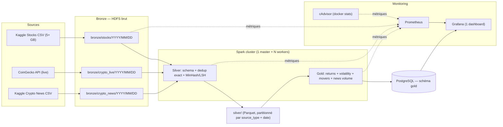

# Projet Big Data — Data Lake & Warehouse avec Monitoring

**Auteur :** Adam Jemaa  
**Promotion :** IPSSI 2026 — édition dataset simple  
**Sujet :** plateforme data lake + warehouse — Medallion Bronze/Silver/Gold, ≥5 Go de données mixtes, Spark non local sur cluster Docker, monitoring Grafana par couche, dashboard comparatif (TradingView Lightweight Charts + chord + ridgeline + radar + word cloud + bubble map) sur données OHLCV + headlines crypto.

---

## 1. Présentation

Plateforme data lake + warehouse suivant l'architecture Medallion (Bronze → Silver → Gold). Ingestion automatisée de données mixtes (structurées et non structurées) depuis **Kaggle US stocks OHLCV** (archive bulk) + **CoinGecko live crypto API** + **Kaggle crypto news headlines**. Transformations distribuées via Apache Spark sur cluster Docker (1 worker par défaut, scalable via `--scale`). KPIs financiers exposés dans PostgreSQL, supervisés via Grafana + Prometheus + cAdvisor.

Objectif métier : **veille financière** corrélant cours boursiers, retours quotidiens et volume de news crypto pour détecter mouvements anormaux.

---

## Flux global du pipeline



Les flèches pleines portent les données : Sources → Bronze HDFS → Spark Silver → Spark Gold → Postgres. Les flèches pointillées portent les métriques vers Prometheus, qui alimente Grafana.

---

## 2. Conformité au cahier des charges

| Exigence (docx) | Couverture | Localisation |
|---|---|---|
| Bronze / Silver / Gold | OK | `scripts/fetch_*.py` (Bronze) + `jobs/silver_transform.py` + `jobs/gold_kpis.py` |
| 5 Go+ données mixtes | OK | Kaggle US stocks OHLCV (bulk) + Kaggle crypto news headlines |
| Structuré + non structuré | OK | OHLCV (structuré) + news headlines (non structuré) |
| Fetch automatisé via API | OK | `scripts/fetch_crypto_live.py` (CoinGecko, cron) + `scripts/fetch_stocks.py` (Kaggle bulk) |
| Spark non local | OK | Cluster Docker : 1 master + N workers (défaut 1, scalable via `--scale`) |
| Workers logiques | OK | `docker compose up --scale spark-worker=N` |
| Aucune configuration manuelle | OK | `.env` + YAML, aucun `.sh` |
| Monitoring Grafana | OK | `monitoring/grafana/dashboards/` (1 dashboard, 6-8 panels) |
| Métriques par couche | OK | Bronze (records, durée), Silver (nulls, invalides, doublons exacts + approx), Gold (retours, volatilité, lignes chargées) |
| Prometheus + métriques système | OK | `monitoring/prometheus.yml` + `cadvisor` (docker stats, remplace node-exporter) |
| PostgreSQL pour Gold | OK | Service `postgres` dans `docker-compose.yml` |
| HDFS | OK | Services `namenode` + `datanode` (apache/hadoop image) |
| Docker Compose + Makefile | OK | `docker-compose.yml` + `Makefile` (up/down/bulk/crypto-live/ingest-news/transform/load/monitor/demo/test/reset) |

---

## 3. Sources de données

### Sources principales

| Source | Type | Structuré | Non structuré | Volume visé |
|---|---|---|---|---|
| **Kaggle US Stocks OHLCV** | Archive CSV | ticker, date, open/high/low/close, volume | — | 5+ Go (1 chargement) |
| **CoinGecko API** | Live REST | date, ticker, close, volume | — | 10k calls/mois |
| **Kaggle Crypto News** | Archive CSV | date, ticker, source, URL | headline | ~50 Mo (1 chargement) |

**Total attendu : > 5 Go** (bulk) + flux live cumulé.

### Sources complémentaires

- **Kaggle "Huge Stock Market Dataset" (borismarjanovic).** Historique quotidien OHLCV pour ~7000 actions et ETF US depuis 1962. ~5 Go compressé. Bulk unique via `scripts/fetch_stocks.py`.
- **CoinGecko API.** Flux live quotidien BTC/ETH/top coins via `/coins/{id}/market_chart`. Free tier, no key, 10-30 calls/min. Couvre l'exigence « fetch automatisé via API ».
- **Kaggle "Crypto News Headlines & Market Prices by Date" (aaroncbastian).** Headlines cryptos (non structuré) + prix daily (structuré) joints par date. Bulk unique via `scripts/fetch_news.py`.

### Justification du choix (option 11 du cahier des charges)

L'option 11 (Trading/Crypto) coche toutes les cases du brief :

- **Mixte** : OHLCV (nombres) + news headlines (texte libre) + live API (flux continu).
- **API-fetchable** : CoinGecko sans clé, 10k calls/mois, historique depuis 2014.
- **5 Go+ rapide** : bulk Kaggle stocks (~5 Go) + bulk news headlines (~50 Mo) = volume immédiat en un chargement.
- **Analytiquement riche** : daily returns, rolling volatility, top movers, news correlation → KPIs financiers au-delà du simple sentiment.

---

## 4. Architecture Medallion

### Bronze — données brutes

- Ingestion des archives Kaggle (stocks, news) et flux CoinGecko (crypto_live) sans transformation.
- Stockage sur **HDFS** (`/data/bronze/{stocks,crypto_live,crypto_news}/{YYYY/MM/DD}/`).
- Partitionnement par date d'ingestion.
- Métriques : nombre de records écrits, durée d'ingestion, statut (succès/échec par lot).

### Silver — données nettoyées et indexées

- Lecture Bronze depuis HDFS, transformation via **Spark** distribué.
- Validation de schéma, conversion de types, parsing des timestamps.
- **Déduplication exacte** : hash SHA-256 sur `(source, external_id, ingested_at)`.
- **Déduplication approximative** : MinHash + LSH (datasketch) sur le champ `headline` (5-word shingles), seuil Jaccard 0.8.
- Enrichissement : colonne `source_type` (`stock_ohlcv` | `crypto_ohlcv` | `crypto_news`).
- Stockage **Parquet** partitionné par `source_type` et date.
- Métriques : comptage nulls par colonne, records invalides, doublons exacts + approximatifs trouvés, durée transformation.

### Gold — KPIs et entrepôt

Lecture Silver, agrégations via Spark SQL :

- **Daily prices** : OHLCV par ticker par jour (dernier close par source).
- **Daily returns** : variation en % vs jour précédent, par ticker.
- **Top movers** : top 10 gainers + 10 losers par jour.
- **Rolling volatility 7d** : écart-type glissant sur 7 jours des retours, par ticker.
- **News volume per coin** : nombre de headlines par ticker par jour.

Chargement dans **PostgreSQL** (schéma `gold`, tables partitionnées par date).

Métriques : durée de calcul, lignes agrégées, lignes écrites en base.

---

## 5. Stack technique

| Composant | Technologie | Rôle |
|---|---|---|
| **Orchestration** | Makefile + cron | Cible Bronze → Silver → Gold via `make demo` |
| **Traitement distribué** | Apache Spark (cluster Docker, 1 master + N workers) | Transformations Silver + Gold |
| **Stockage brut** | HDFS (apache/hadoop) | Couche Bronze |
| **Stockage intermédiaire** | HDFS | Couche Silver (Parquet) |
| **Entrepôt** | PostgreSQL 16 | Couche Gold (schéma `gold`) |
| **Monitoring** | Prometheus + cAdvisor + Grafana | Métriques cluster + per-layer ops, 1 dashboard |
| **Conteneurisation** | Docker Compose | Services + limites mémoire laptop (commentées dans `docker-compose.yml`) |
| **CLI** | Makefile | `make up/down/bulk/crypto-live/ingest-news/transform/load/monitor/demo/test/reset/logs` |

Aucun service cloud externe. Stack locale, reproductible, conforme au sujet. Les `mem_limit` par service sont commentés dans `docker-compose.yml` (décommentez pour un laptop 16 Go avec Docker Desktop réglé sur 10 Go). En production, laissez-les commentés : Docker alloue librement.

---

## 6. Monitoring & observabilité

### Stack

- **Prometheus** scrape :
  - cAdvisor (CPU, RAM, disque, I/O par conteneur Docker). Remplace Node Exporter, mêmes métriques sans la complexité d'un service additionnel.
  - `spark-master` / `spark-workers` (métriques Spark via JMX exporter).
  - `postgres-exporter` (connexions, requêtes, latence).
  - Métriques applicatives émises par les jobs Python (pushgateway).
- **Grafana** : 1 dashboard unifié (6–8 panels) provisionné automatiquement :
  1. Cluster — CPU/RAM/disque par conteneur (depuis cAdvisor).
  2. Bronze — Records écrits / durée d'ingestion.
  3. Silver — Doublons exacts + approximatifs trouvés, durée transformation.
  4. Gold — Retours quotidiens, volatilité 7j, lignes chargées.
  5. Métier — Top movers, news volume par coin, sentiment VADER sur headlines.

### Métriques exposées

Émises par les jobs Python via `prometheus_client` (pushgateway) ou par les exporters de service :

- `bronze_records_total{source}`
- `bronze_write_duration_seconds{source}`
- `silver_null_count_total{column, source}`
- `silver_duplicates_exact_total{source}`
- `silver_duplicates_approximate_total{source}`
- `silver_invalid_records_total{source}`
- `gold_rows_loaded_total{table}`
- `gold_kpi_compute_duration_seconds{kpi}`

### Pourquoi 1 dashboard et non 3

Le brief demande du monitoring par couche, pas un nombre de dashboards. Un dashboard unifié à 6-8 panels couvre les trois axes (cluster, pipeline, métier) en une vue, plus simple à démontrer et à maintenir.

---

## 7. Indicateurs métier (KPIs)

| KPI | Description | Source |
|---|---|---|
| Daily prices | OHLCV par ticker par jour | Silver (price_daily) |
| Daily returns | Variation % vs jour précédent, par ticker | Silver (price_daily) |
| Top movers | Top 10 gainers + losers par jour | Gold |
| Rolling volatility 7d | Écart-type glissant 7j des retours | Gold |
| News volume | Nombre de headlines crypto par jour | Silver + Gold |
| VADER sentiment | Score moyen des headlines crypto | Gold (bonus) |

## 7b. Dashboard comparatif

Le dashboard Next.js expose deux nouvelles routes en plus de l'overview / pipeline :

- **`/analysis`** : sélection multi-tickers (2 à 6) → six visualisations comparatives :
  - Histogramme des distributions de rendements journaliers par ticker (chevauchement transparent).
  - Ridgeline plot : densités empilées (Gaussian KDE, bandwidth type Silverman).
  - Diagramme chord : corrélations deux-à-deux entre tickers (largeur = |corr|, vert = positive, rouge = négative).
  - Radar multi-métriques : mean return, volatility, news volume, latest price (normalisés 0..1).
  - Bubble map : x=date, y=|return|, taille=|volume|, couleur=sign du return.
  - Word cloud : top termes des headlines crypto pour les tickers sélectionnés (via `react-wordcloud`).
- **`/symbol/[ticker]`** : page détail par ticker avec :
  - Graphique OHLCV candlestick (TradingView **Lightweight Charts** — librairie OSS MIT, pas l'API TradingView).
  - Stats : latest close, total return %, days tracked, news count.
  - Liste des news headlines extraites du CSV CryptoDataDownload (champ `articles`).
  - Source attribution : d'où viennent les données (Bronze path, ingestion date).

**Ce que nous N'avons PAS** (honnête sur les limites du livrable) :
- Pas de fondamentaux (P/E, EPS, market cap, dividends).
- Pas de prix temps réel (uniquement archives statiques).
- Pas de données d'analystes ou de ratings.
- Pas de filings SEC.
- Pas d'API TradingView (on utilise leur librairie OSS Lightweight Charts pour dessiner nos propres données).

C'est un **outil exploratoire** sur le dataset ingéré, pas un service de recommandation d'investissement. Aucune suggestion de trade.

---

## 8. Structure du dépôt

```
BigDataProject/
├── docker-compose.yml              # namenode, datanode, spark-master, spark-worker, postgres, prometheus, grafana, cadvisor
├── Makefile                        # make up/down/bulk/crypto-live/ingest-news/transform/load/monitor/demo/test/reset/logs
├── .env.example                    # Template des variables d'environnement
├── config/
│   ├── spark/                      # spark-defaults.conf, log4j.properties
│   ├── hdfs/                       # core-site.xml, hdfs-site.xml
│   └── postgres/                   # init.sql (schéma gold)
├── scripts/
│   ├── fetch_stocks.py            # Ingestion Bronze : Kaggle stocks OHLCV (bulk CSV)
│   ├── fetch_crypto_live.py       # Ingestion Bronze : CoinGecko API (live)
│   ├── fetch_news.py              # Ingestion Bronze : Kaggle crypto news headlines
│   └── upload_to_hdfs.py           # Wrapper HDFS (WebHDFS + fallback /tmp)
├── jobs/
│   ├── silver_transform.py         # Spark : schéma + dedup exact (SHA-256) + approx (MinHash/LSH) + Parquet
│   ├── gold_kpis.py                # Spark : returns + volatilité + movers + news volume → Postgres
│   └── silver_utils.py             # Schemas Spark-free + helpers pour tests
├── sql/
│   └── gold_schema.sql             # DDL tables Gold partitionnées (daily_prices, daily_returns, top_movers, volatility, news_volume)
├── tests/
│   ├── test_smoke_bronze.py        # 10 records → 10 sur HDFS
│   ├── test_smoke_silver.py        # 10 records → 10 Parquet valides
│   └── test_smoke_gold.py          # 10 records → 10 lignes Postgres
├── monitoring/
│   ├── prometheus.yml              # Scrape config (spark, postgres, cadvisor, pushgateway)
│   ├── alerts.yml                  # Règles d'alerte (pipeline en retard, espace HDFS)
│   └── grafana/
│       ├── dashboards/             # 1 dashboard JSON unifié (6-8 panels)
│       └── provisioning/           # datasources + dashboard auto-load
├── notebooks/
│   └── exploration.ipynb           # Dev / debug local (pas dans le pipeline prod)
├── main.py                         # Point d'entrée : orchestration des 3 jobs
├── requirements.txt                # praw, requests, pyspark, vaderSentiment, datasketch, prometheus_client, psycopg2-binary
└── README.md
```

---

## 9. Démarrage rapide

### Pré-requis

- Docker + Docker Compose v2.
- Python 3.11+ (pour exécution locale des scripts d'ingestion).
- 16 Go RAM minimum (cluster Spark + HDFS + Postgres + monitoring).
- **Docker Desktop : allouer 10 Go de RAM minimum** (Settings → Resources → Memory).
- Kaggle account (for downloading the stocks dataset).

### Configuration

```bash
cp .env.example .env
# Renseigner : STOCKS_BULK_PATH (chemin local vers le CSV Kaggle stocks),
#             NEWS_BULK_PATH (chemin local vers le CSV Kaggle crypto news)
```

### Téléchargement des datasets

1. **Kaggle "Huge Stock Market Dataset"** par borismarjanovic
   - URL : https://www.kaggle.com/datasets/borismarjanovic/price-volume-data-for-all-us-stocks-etfs
   - Télécharger le CSV (~5 Go), placer dans `data/stocks_etfs.csv`

2. **Kaggle "Crypto News Headlines & Market Prices by Date"** par aaroncbastian
   - URL : https://www.kaggle.com/datasets/aaroncbastian/crypto-news-headlines-and-market-prices-by-date
   - Télécharger le CSV, placer dans `data/crypto_news.csv`

3. **CoinGecko API** : pas de téléchargement, appelé en live par `scripts/fetch_crypto_live.py`.

### Commandes

```bash
make up              # Démarre tout le cluster (HDFS, Spark, Postgres, Prometheus, Grafana, cAdvisor)
make init-hdfs       # Crée les répertoires /data/bronze, /data/silver, /data/gold
make bulk            # Bronze : charge le CSV stocks → HDFS
make crypto-live     # Bronze : pull CoinGecko BTC 90j → HDFS
make ingest-news     # Bronze : charge le CSV crypto news → HDFS
make transform       # Silver : nettoyage + dedup SHA-256 + MinHash/LSH → HDFS Parquet
make load            # Gold : returns + volatility + movers + news volume → Postgres
make demo            # Tout en un : up + bulk + transform + load + URLs Grafana/Prometheus
make monitor         # Ouvre Grafana (http://localhost:3000) + Prometheus (http://localhost:9090)
make test            # Smoke tests pytest (Bronze/Silver/Gold, 10 records chacun)
make logs            # Tail des logs de tous les services
make down            # Stop + suppression des conteneurs (volumes préservés)
make reset           # Down + suppression des volumes (reset complet)
```

### URLs locales

| Service | URL | Identifiants |
|---|---|---|
| Spark Master UI | http://localhost:8088 | — |
| HDFS NameNode UI | http://localhost:9870 | — |
| PostgreSQL | `localhost:5432` | `gold` / `gold` / `gold` |
| Prometheus | http://localhost:9090 | — |
| Grafana | http://localhost:3000 | `admin` / `admin` |
| cAdvisor | http://localhost:8081 | — |

---

## 10. Variables d'environnement

Tout via `.env` (jamais commit) :

| Variable | Usage |
|---|---|
| `STOCKS_BULK_PATH` | Chemin local vers le CSV Kaggle stocks (pour `make bulk`) |
| `NEWS_BULK_PATH` | Chemin local vers le CSV Kaggle crypto news (pour `make ingest-news`) |
| `HDFS_NAMENODE` | Hôte HDFS (default `namenode`) |
| `POSTGRES_HOST`, `POSTGRES_PORT`, `POSTGRES_DB`, `POSTGRES_USER`, `POSTGRES_PASSWORD` | Connexion Gold |
| `SPARK_MASTER_URL` | URL du master Spark |
| `GRAFANA_ADMIN_PASSWORD` | Mot de passe admin Grafana |
| `PROMETHEUS_RETENTION` | Durée de rétention TSDB (default `15d`) |
| `CADVISOR_PORT` | Port UI cAdvisor (default `8081`) |

---

## 11. Justification de l'architecture

**Stack 100% Docker locale.**
- Conformité directe avec le sujet (Docker Compose, HDFS, Spark, PostgreSQL, Prometheus, Grafana).
- Tout l'environnement tient dans `docker-compose.yml` (+ mem_limit commentés pour laptop).
- Aucun quota API cloud, aucun coût récurrent.
- On voit passer chaque couche dans Grafana, on débugue vraiment Spark distribué.

**Spark distribué (workers logiques).**
- `docker compose up --scale spark-worker=N` scale à la demande.
- Défaut : 1 worker (suffisant pour le volume traité, économe en RAM laptop).
- Spark UI (`localhost:8088`) visualise le DAG et le scheduling.

**cAdvisor plutôt que Node Exporter.**
- Node Exporter ajoute un service pour des métriques CPU/RAM que `docker stats` expose déjà.
- cAdvisor (= `google/cadvisor`) parle nativement Prometheus et graphe par conteneur.
- Un service en moins, même couverture monitoring, intégration Grafana triviale.

**Un dashboard Grafana plutôt que trois.**
- Le brief demande du monitoring par couche, pas un nombre de dashboards.
- Un dashboard unifié à 6-8 panels couvre cluster + Bronze + Silver + Gold + métier en une vue.
- Plus simple à démontrer, à maintenir, à défendre à l'oral.

**Choix de Trading/Crypto (option 11 du cahier des charges).**
- Bulk : le dataset Kaggle stocks (~5 Go) atteint le volume exigé en un seul chargement. Pushshift / archive Reddit n'est plus accessible depuis 2023, Kaggle / Arctic Shift / torrent sont les alternatives viables.
- Live : CoinGecko couvre l'exigence « fetch automatisé via API ».
- Subject finance : les KPIs financiers (returns, volatility, movers) sont plus rigoureux que du sentiment générique et démontrent mieux la valeur analytique du pipeline.
- Voir §3 pour le détail dataset.

**VADER pour le sentiment des headlines.**
- Standard pour texte social/news, rapide, pas de GPU, intégré NLTK.
- Optimisé pour l'anglais, moins pour les langues européennes. Acceptable pour ce projet, mentionné explicitement.
- Utilisé en bonus sur le champ `headline` de la couche Gold, pas comme KPI principal.

**Stratégie mem_limit (laptop).**
- Les `mem_limit` par service sont commentés dans `docker-compose.yml` ; décommentez selon votre machine.
- Total idle ≈ 5-7 Go, processing peak ≈ 8-12 Go, marge confortable sur 16 Go physiques avec Docker Desktop à 10 Go.
- En production (32 Go+), laissez les `mem_limit` commentés : Docker alloue librement.

---

## 12. Limites connues & pistes d'amélioration

- **VADER limité au texte court social/news.** Migrer vers un modèle transformer (FinBERT ou DistilBERT) pour le news en v2.
- **CoinGecko rate limit (10k calls/mois).** Suffisant pour démo, à compléter par CryptoDataDownload pour la production.
- **1 worker Spark par défaut.** La scalabilité est démontrée par `--scale` mais pas stress-testée sur ce livrable.
- **Smoke tests uniquement.** pytest couvre 10 records par couche, pas de tests de propriétés.
- **Pas de cross-source correlation.** Pour aller plus loin : corrélation retours quotidiens vs news volume sur la même fenêtre temporelle → détection d'événements anormaux.
