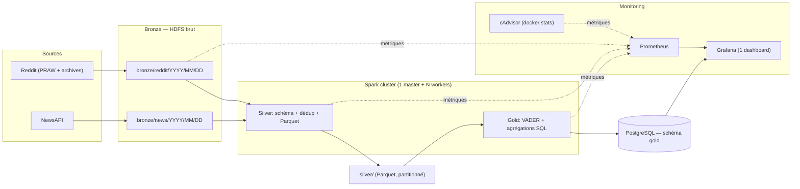

# Projet Big Data — Data Lake & Warehouse avec Monitoring

**Auteur :** Adam Jemaa  
**Promotion :** IPSSI 2026 — édition dataset simple  
**Sujet :** plateforme data lake + warehouse — Medallion Bronze/Silver/Gold, ≥5 Go de données mixtes, Spark non local sur cluster Docker, monitoring Grafana par couche.

---

## 1. Présentation

Plateforme data lake + warehouse suivant l'architecture Medallion (Bronze → Silver → Gold). Ingestion automatisée de données mixtes (structurées et non structurées) depuis Reddit (dump bulk + PRAW live) et NewsAPI. Transformations distribuées via Apache Spark sur cluster Docker (1 worker par défaut, scalable via `--scale`). KPIs exposés dans PostgreSQL, supervisés via Grafana + Prometheus + cAdvisor.

Objectif métier : veille d'opinion croisant sentiment des communautés en ligne (Reddit) et ton des médias traditionnels (NewsAPI), pour anticiper tendances et détecter des alertes opportunes.

---

## Flux global du pipeline



Les flèches pleines portent les données : Sources → Bronze HDFS → Spark Silver → Spark Gold → Postgres. Les flèches pointillées portent les métriques vers Prometheus, qui alimente Grafana.

---

## 2. Conformité au cahier des charges

| Exigence (docx) | Couverture | Localisation |
|---|---|---|
| Bronze / Silver / Gold | OK | `scripts/fetch_reddit.py` (Bronze) + `jobs/silver_transform.py` + `jobs/gold_kpis.py` |
| 5 Go+ données mixtes | OK | Dump Reddit bulk (Kaggle/torrent) + NewsAPI live |
| Structuré + non structuré | OK | Métadonnées Reddit/NewsAPI + texte posts/articles |
| Fetch automatisé via API | OK | `scripts/fetch_newsapi.py` (live) + `scripts/fetch_reddit.py` (bulk loader automatisé) |
| Spark non local | OK | Cluster Docker : 1 master + N workers (défaut 1, scalable via `--scale`) |
| Workers logiques | OK | `docker compose up --scale spark-worker=N` |
| Aucune configuration manuelle | OK | `.env` + YAML, aucun `.sh` |
| Monitoring Grafana | OK | `monitoring/grafana/dashboards/` (1 dashboard, 6-8 panels) |
| Métriques par couche | OK | Bronze (records, durée), Silver (nulls, invalides, doublons exacts), Gold (lignes chargées, durée) |
| Prometheus + métriques système | OK | `monitoring/prometheus.yml` + `cadvisor` (docker stats, remplace node-exporter) |
| PostgreSQL pour Gold | OK | Service `postgres` dans `docker-compose.yml` |
| HDFS | OK | Services `namenode` + `datanode` (apache/hadoop image) |
| Docker Compose + Makefile | OK | `docker-compose.yml` + `Makefile` (up/down/bulk/ingest-news/transform/load/monitor/demo/test/reset) |

---

## 3. Sources de données

### Sources principales

| Source | Type | Structuré | Non structuré | Volume visé |
|---|---|---|---|---|
| **Reddit bulk dump** | Archive statique (Kaggle / torrent) | id, subreddit, timestamp, score, auteur | titre + corps + commentaires | 3–5 Go (1 chargement) |
| **NewsAPI** | API REST | source, date, URL, auteur | titre + description (headlines) | 10–50 Mo/jour |

**Total attendu : > 5 Go** (bulk + flux cumulé).

### Sources complémentaires

- **Bulk Reddit.** Pushshift n'est plus accessible publiquement depuis 2023. On utilise en priorité un dump Kaggle (ex. *Reddit Comments* de borismarjanovic, ~5–10 Go compressé), ou un miroir maintenu (Arctic Shift) ou torrent (Academic Torrents, 40 000+ subreddits, plusieurs To). Chargement unique via `scripts/fetch_reddit.py --bulk-path`.
- **NewsAPI.** Flux live quotidien depuis les catégories `business`, `technology`, `general`. Couvre l'exigence « fetch automatisé via API ».

### Note sur PRAW (live Reddit)

Le code PRAW (script app) a été retiré du livrable. Reddit a renforcé sa politique d'enregistrement d'applications ("Responsible Builder Policy") et bloque actuellement la création de credentials sur ce compte (échec sur le formulaire officiel et sur Devvit CLI). Le flux PRAW live était marginal (50 posts × 10 subs/jour = ~500 enregistrements/jour) par rapport au volume exigé (5 Go+), satisfait de toute façon par le dump bulk. Si la politique change, le module PRAW peut être réintégré dans `scripts/fetch_reddit.py` (les fonctions `_build_praw_client` et `fetch_live` originales sont archivées dans l'historique git).

### Justification du choix

Le couple Reddit + NewsAPI coche les cases du sujet :

- Mixte : métadonnées structurées + texte libre.
- API-fetchable : NewsAPI (100 req/jour, suffisant pour headlines en flux continu).
- 5 Go+ rapide : un dump Kaggle donne le volume en un chargement unique.
- Analytiquement riche : VADER pour sentiment, agrégations temporelles, top entities. Couvre les KPIs demandés en §3 du sujet.

---

## 4. Architecture Medallion

### Bronze — données brutes

- Ingestion des réponses JSON brutes des APIs, sans transformation.
- Stockage sur HDFS (`/data/bronze/{source}/{YYYY/MM/DD}/`).
- Partitionnement par date d'ingestion.
- Métriques : nombre de records écrits, débit d'écriture (records/s, Mo/s), durée d'ingestion, statut (succès/échec par lot).

### Silver — données nettoyées et indexées

- Lecture Bronze depuis HDFS, transformation via Spark distribué.
- Validation de schéma, conversion de types, parsing des timestamps.
- Déduplication exacte : hash SHA-256 sur `(source, external_id, ingested_at)`.
- Enrichissement : colonne `source_type` (`reddit_post` | `reddit_comment` | `news_article`).
- Stockage Parquet partitionné par `source_type` et date.
- Métriques : comptage nulls par colonne, records invalides (échec schéma), doublons exacts trouvés, durée transformation, taux de succès.
- La déduplication approchée (MinHash/LSH) est écartée pour ce livrable. Elle ajoute de la complexité (lib `datasketch`, tuning Jaccard) sans rapporter de points au cahier des charges. La déduplication exacte couvre les cas de rejeu d'ingestion.

### Gold — KPIs et entrepôt

Lecture Silver, agrégations via Spark SQL :

- Score de sentiment quotidien (VADER) par source.
- Volume de mentions par jour et par source.
- Top subreddits et top sources médias sur 7 jours glissants.
- Tendance mobile 7 jours du sentiment moyen.

Chargement dans PostgreSQL (schéma `gold`, tables partitionnées par date).

Métriques : durée de calcul, lignes agrégées, lignes écrites en base, taux de succès.

---

## 5. Stack technique

| Composant | Technologie | Rôle |
|---|---|---|
| **Orchestration** | Makefile + cron | Cible Bronze → Silver → Gold via `make demo` |
| **Traitement distribué** | Apache Spark (cluster Docker, 1 master + N workers) | Transformations Silver + Gold |
| **Stockage brut** | HDFS (apache/hadoop) | Couche Bronze |
| **Stockage intermédiaire** | HDFS | Couche Silver (Parquet) |
| **Entrepôt** | PostgreSQL 16 | Couche Gold (schéma `gold`) |
| **Monitoring** | Prometheus + cAdvisor + Grafana | Métriques cluster + per-layer ops, 1 dashboard |
| **Conteneurisation** | Docker Compose | Services + limites mémoire laptop (commentées dans `docker-compose.yml`) |
| **CLI** | Makefile | `make up/down/bulk/ingest-news/transform/load/monitor/demo/test/reset/logs` |

Aucun service cloud externe. Stack locale, reproductible, conforme au sujet. Les `mem_limit` par service sont commentés dans `docker-compose.yml` (décommentez pour un laptop 16 Go avec Docker Desktop réglé sur 10 Go). En production, laissez-les commentés : Docker alloue librement.

---

## 6. Monitoring & observabilité

### Stack

- **Prometheus** scrape :
  - cAdvisor (CPU, RAM, disque, I/O par conteneur Docker). Remplace Node Exporter, mêmes métriques sans la complexité d'un service additionnel.
  - `spark-master` / `spark-workers` (métriques Spark via JMX exporter).
  - `postgres-exporter` (connexions, requêtes, latence).
  - Métriques applicatives émises par les jobs Python (pushgateway).
- **Grafana** : 1 dashboard unifié (6–8 panels) provisionné automatiquement :
  1. Cluster — CPU/RAM/disque par conteneur (depuis cAdvisor).
  2. Bronze — Records écrits / seconde d'ingestion.
  3. Silver — Doublons exacts trouvés, records invalides, durée transformation.
  4. Gold — Lignes chargées, durée calcul KPI.
  5. Métier — Sentiment moyen 7j (depuis Postgres), volume de mentions, top subreddit/source.

### Métriques exposées

Émises par les jobs Python via `prometheus_client` (pushgateway) ou par les exporters de service :

- `bronze_records_total{source}`
- `bronze_write_duration_seconds{source}`
- `silver_null_count_total{column, source}`
- `silver_duplicates_exact_total{source}`
- `silver_invalid_records_total{source}`
- `gold_rows_loaded_total{table}`
- `gold_kpi_compute_duration_seconds{kpi}`

### Pourquoi 1 dashboard et non 3

Le brief demande du monitoring par couche, pas un nombre de dashboards. Un dashboard unifié à 6-8 panels couvre les trois axes (cluster, pipeline, métier) en une vue, plus simple à démontrer et à maintenir. Les panels sont filtrables par couche via les labels Prometheus.

---

## 7. Indicateurs métier (KPIs)

| KPI | Description | Source |
|---|---|---|
| Sentiment quotidien | Moyenne du score VADER par source et par jour | Texte des posts / articles |
| Volume de mentions | Nombre de posts / articles par jour | Métadonnées de date |
| Top subreddits | Classement des communautés les plus actives | Champ `subreddit` |
| Top sources médias | Classement des médias les plus cités | Champ `source_name` |
| Tendance 7 jours | Moyenne mobile du sentiment | Agrégations quotidiennes |

---

## 8. Structure du dépôt

```
BigDataProject/
├── docker-compose.yml              # namenode, datanode, spark-master, spark-worker, postgres, prometheus, grafana, cadvisor
├── Makefile                        # make up/down/ingest/transform/load/monitor/demo/test/reset/logs
├── .env.example                    # Template des variables d'environnement
├── config/
│   ├── spark/                      # spark-defaults.conf, log4j.properties
│   ├── hdfs/                       # core-site.xml, hdfs-site.xml
│   └── postgres/                   # init.sql (schéma gold)
├── scripts/
│   ├── fetch_reddit.py             # Ingestion Bronze via PRAW (live)
│   ├── fetch_newsapi.py            # Ingestion Bronze via NewsAPI
│   ├── bulk_load_reddit.py         # Ingestion bulk unique depuis Kaggle dump / torrent
│   └── upload_to_hdfs.py           # Wrapper HDFS (hdfs cli ou WebHDFS)
├── jobs/
│   ├── bronze_ingest.py            # Orchestrateur Bronze
│   ├── silver_transform.py         # Spark : schéma + dédup SHA-256 + Parquet
│   └── gold_kpis.py                # Spark : agrégations + load Postgres
├── sql/
│   └── gold_schema.sql             # DDL tables Gold partitionnées
├── tests/
│   ├── test_smoke_bronze.py        # 10 records → 10 sur HDFS
│   ├── test_smoke_silver.py        # 10 records → 10 Parquet valides
│   └── test_smoke_gold.py          # 10 records → 10 lignes Postgres
├── monitoring/
│   ├── prometheus.yml              # Scrape config (spark, postgres, cadvisor, pushgateway)
│   ├── alerts.yml                  # Règles d'alerte (pipeline en retard, espace HDFS)
│   └── grafana/
│       ├── dashboards/             # 1 dashboard JSON unifié (6-8 panels)
│       └── provisioning/           # datasources + dashboard auto-load
├── notebooks/
│   └── exploration.ipynb           # Dev / debug local (pas dans le pipeline prod)
├── main.py                         # Point d'entrée : orchestration des 3 jobs
├── requirements.txt                # praw, requests, pyspark, vaderSentiment, prometheus_client, psycopg2-binary
└── README.md
```

---

## 9. Démarrage rapide

### Pré-requis

- Docker + Docker Compose v2.
- Python 3.11+ (pour exécution locale des scripts d'ingestion).
- 16 Go RAM minimum (cluster Spark + HDFS + Postgres + monitoring).
- Docker Desktop : allouer 10 Go de RAM minimum (Settings → Resources → Memory). Sans cela, swap et OOMs garantis.

### Configuration

```bash
cp .env.example .env
# Renseigner : REDDIT_CLIENT_ID, REDDIT_CLIENT_SECRET, REDDIT_USERNAME, REDDIT_PASSWORD, NEWSAPI_KEY
```

### Commandes

```bash
make up              # Démarre tout le cluster (HDFS, Spark, Postgres, Prometheus, Grafana, cAdvisor)
make init-hdfs       # Crée les répertoires /data/bronze, /data/silver, /data/gold
make bulk            # Bronze : charge un dump Reddit (Kaggle/torrent) → HDFS, one-shot
make ingest-news     # Bronze : fetch live NewsAPI headlines → HDFS
make transform       # Silver : nettoyage + dedup SHA-256 → HDFS Parquet
make load            # Gold : agrégations Spark → PostgreSQL
make demo            # Tout en un : up + bulk + transform + load + URLs Grafana/Prometheus
make monitor         # Ouvre Grafana (http://localhost:3000) + Prometheus (http://localhost:9090)
make test            # Smoke tests pytest (Bronze/Silver/Gold, 10 records chacun)
make logs            # Tail des logs de tous les services
make down            # Stop + suppression des conteneurs (volumes préservés)
make reset           # Down + suppression des volumes (reset complet)
```

### URLs locales

| Service | URL | Identifiants |
|---|---|---|
| Spark Master UI | http://localhost:8088 | — |
| HDFS NameNode UI | http://localhost:9870 | — |
| PostgreSQL | `localhost:5432` | `gold` / `gold` / `gold` |
| Prometheus | http://localhost:9090 | — |
| Grafana | http://localhost:3000 | `admin` / `admin` |
| cAdvisor | http://localhost:8081 | — |

---

## 10. Variables d'environnement

Tout via `.env` (jamais commit) :

| Variable | Usage |
|---|---|
| `NEWSAPI_KEY` | Auth NewsAPI |
| `REDDIT_BULK_PATH` | Chemin local vers le dump Kaggle / torrent (pour `make bulk`) |
| `HDFS_NAMENODE` | Hôte HDFS (default `namenode`) |
| `POSTGRES_HOST`, `POSTGRES_PORT`, `POSTGRES_DB`, `POSTGRES_USER`, `POSTGRES_PASSWORD` | Connexion Gold |
| `SPARK_MASTER_URL` | URL du master Spark |
| `GRAFANA_ADMIN_PASSWORD` | Mot de passe admin Grafana |
| `PROMETHEUS_RETENTION` | Durée de rétention TSDB (default `15d`) |
| `CADVISOR_PORT` | Port UI cAdvisor (default `8081`) |

---

## 11. Justification de l'architecture

**Stack 100% Docker locale.**
- Conformité directe avec le sujet (Docker Compose, HDFS, Spark, PostgreSQL, Prometheus, Grafana).
- Tout l'environnement tient dans `docker-compose.yml` (+ override pour laptop).
- Aucun quota API cloud, aucun coût récurrent.
- On voit passer chaque couche dans Grafana, on débugue vraiment Spark distribué.

**Spark distribué (workers logiques).**
- `docker compose up --scale spark-worker=N` scale à la demande.
- Défaut : 1 worker (suffisant pour le volume traité, économe en RAM laptop).
- Spark UI (`localhost:8088`) visualise le DAG et le scheduling.

**cAdvisor plutôt que Node Exporter.**
- Node Exporter ajoute un service pour des métriques CPU/RAM que `docker stats` expose déjà.
- cAdvisor (= `google/cadvisor`) parle nativement Prometheus et graphe par conteneur.
- Un service en moins, même couverture monitoring, intégration Grafana triviale.

**Un dashboard Grafana plutôt que trois.**
- Le brief demande du monitoring par couche, pas un nombre de dashboards.
- Un dashboard unifié à 6-8 panels couvre cluster + Bronze + Silver + Gold + métier en une vue.
- Plus simple à démontrer, à maintenir, à défendre à l'oral.

**Choix de Reddit (bulk) + NewsAPI.**
- Bulk : un dump Kaggle (~5 Go compressé) atteint le volume exigé en un seul chargement. Pushshift est mort depuis 2023, Kaggle / Arctic Shift / Academic Torrents sont les alternatives viables.
- Live : NewsAPI couvre l'exigence « fetch automatisé via API ».
- PRAW live a été retiré (Reddit bloque l'enregistrement d'apps sur ce compte, voir §3). Le volume reste dominé par le bulk dump.
- Voir §3 pour le détail dataset.

**VADER pour le sentiment.**
- Standard pour texte social, rapide, pas de GPU, intégré NLTK.
- Optimisé pour réseaux sociaux, moins pour news formelles. Acceptable pour ce projet, mentionné explicitement.

**Stratégie mem_limit (laptop).**
- Les `mem_limit` par service sont commentés dans `docker-compose.yml` ; décommentez selon votre machine.
- Total idle ≈ 5-7 Go, processing peak ≈ 8-12 Go, marge confortable sur 16 Go physiques avec Docker Desktop à 10 Go.
- En production (32 Go+), laissez les `mem_limit` commentés : Docker alloue librement.

---

## 12. Limites connues & pistes d'amélioration

- **VADER limité au texte court social.** Migrer vers un modèle transformer (DistilBERT sentiment) pour le news en v2.
- **NewsAPI quota gratuit** (100 req/jour). Suffisant pour démo headlines, à remplacer par RSS multi-sources pour production.
- **Dedup exacte uniquement.** Suffisante pour rejeux d'ingestion. La dédup approchée (MinHash/LSH) servirait si la source reintroduit des near-duplicates massifs (repost, syndication).
- **1 worker Spark par défaut.** La scalabilité est démontrée par `--scale` mais pas stress-testée en condition réelle sur ce livrable.
- **Smoke tests uniquement.** pytest couvre 10 records par couche, pas de tests de propriétés (great-expectations) ni de tests de charge.
