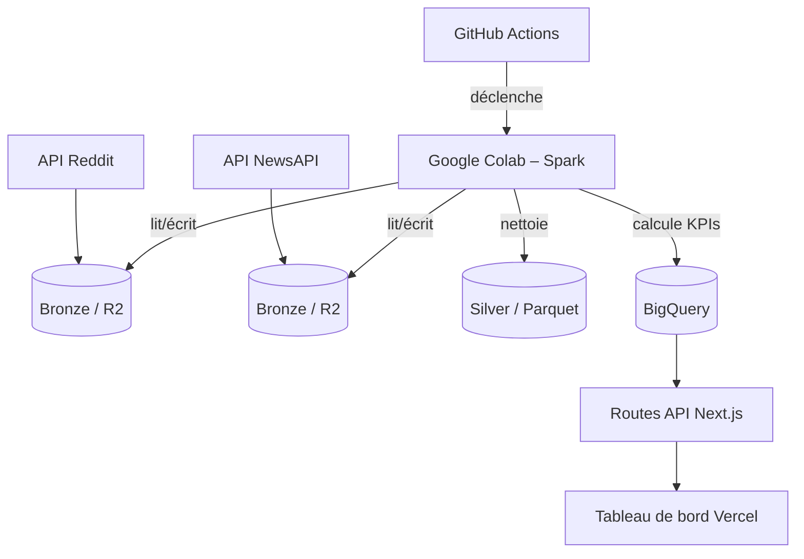

# Projet Big Data – Plateforme d'Analyse de Sentiment Reddit & News

## Présentation

Ce projet met en œuvre une plateforme complète de **data lake** et d'**entrepôt de données** suivant l'architecture **Medallion** (couches Bronze, Silver et Gold). Il assure l'ingestion automatisée de données mixtes (structurées et non structurées) issues de **Reddit** et de **NewsAPI**, applique des transformations avec validation de qualité, calcule des indicateurs métier (KPIs) et expose un tableau de bord de monitoring.

---

## Objectif Métier

Construire une solution de **veille d'opinion** qui croise le sentiment des communautés en ligne (Reddit) avec le ton des médias traditionnels (NewsAPI). L'analyse temporelle et la corrélation entre ces deux univers permettent d'anticiper des tendances, de mesurer l'impact médiatique et de fournir des alertes opportunes.

---

## Sources de Données

| Source | Type | Métadonnées structurées | Contenu non structuré | Accès | Volume |
|--------|------|--------------------------|------------------------|-------|--------|
| **Reddit** (API PRAW) | Mixte | Score, date, subreddit, auteur, nb commentaires | Titres et corps des posts / commentaires | API gratuite, rate limiting géré | Scraping continu → 5 Go+ |
| **NewsAPI** (API REST) | Mixte | Source, date de publication, URL, auteur | Titres, descriptions, contenu des articles | 100 requêtes/jour (gratuit), historique 1 mois | ~100 articles/jour |

Ces deux sources répondent conjointement aux exigences de **volume** (Reddit), de **diversité** (structuré / non structuré) et de **récupération automatisée** via API.

---

## Architecture Medallion

La plateforme s'articule en trois couches logicielles distinctes.

### Bronze – Données brutes
- Stockage des réponses JSON brutes des APIs, sans transformation.
- Partitionnement par date d'ingestion dans **Cloudflare R2** (stockage objet S3-compatible).

### Silver – Données nettoyées et indexées
- Validation de schéma, conversion de types, déduplication exacte et approchée.
- Enrichissement avec une colonne `source_type` et extraction des champs pertinents.
- Stockage au format **Parquet** pour des performances de requête optimales.

### Gold – KPIs et entrepôt
- Calcul des indicateurs métier :
  - **Score de sentiment quotidien** (VADER) par source
  - **Volume de mentions** par jour
  - **Top subreddits** et **top sources médias**
  - **Tendance mobile sur 7 jours**
- Stockage des résultats dans **Google BigQuery**, accessible pour le tableau de bord.

---

## Flux de Données



---

## Stack Technique

| Composant | Service | Rôle |
|-----------|---------|------|
| **Orchestration** | GitHub Actions | Planification (cron) et déclenchement du pipeline |
| **Traitement distribué** | Google Colab (Spark) | Exécution des jobs PySpark (12 Go RAM, gratuit) |
| **Stockage (Bronze/Silver)** | Cloudflare R2 | Bucket S3, 10 Go gratuits, persistant |
| **Entrepôt (Gold)** | Google BigQuery | 10 Go stockage + 1 To requêtes/mois, intégration native avec Vercel |
| **Tableau de bord** | Vercel + Next.js (TypeScript) | Application full-stack, routes API sécurisées, mise à jour dynamique |
| **Monitoring** | Logs GitHub Actions + BigQuery | Suivi des exécutions et des requêtes, aucun outil supplémentaire nécessaire |

---

## Indicateurs Métier (KPIs)

| KPI | Description | Source |
|-----|-------------|--------|
| Sentiment quotidien | Moyenne du score VADER par source et par jour | Texte des posts / articles |
| Volume de mentions | Nombre de posts / articles par jour | Métadonnées de date |
| Top subreddits | Classement des communautés les plus actives | Champ `subreddit` |
| Top sources médias | Classement des médias les plus cités | Champ `source_name` |
| Tendance 7 jours | Moyenne mobile du sentiment pour détecter les inflexions | Agrégations quotidiennes |

---

## Déploiement et Configuration

L'ensemble de la configuration s'effectue via des **variables d'environnement** et des **secrets GitHub**. Aucune intervention manuelle sur les serveurs n'est nécessaire.

### Variables d'environnement

Les clés suivantes doivent être définies dans les secrets du dépôt GitHub :

- `REDDIT_CLIENT_ID`, `REDDIT_CLIENT_SECRET`, `REDDIT_USERNAME`, `REDDIT_PASSWORD`
- `NEWSAPI_KEY`
- `R2_ACCESS_KEY`, `R2_SECRET_KEY`, `R2_BUCKET_NAME`, `R2_ENDPOINT`
- `BIGQUERY_PROJECT`, `BIGQUERY_DATASET`, `BIGQUERY_CREDENTIALS_JSON`

### Workflow GitHub Actions

Un fichier `.github/workflows/pipeline.yml` définit le déclenchement automatique toutes les 6 heures (ou à la demande). Il installe les dépendances Python, puis exécute le script `main.py` qui :

1. Récupère les données via les APIs (couche Bronze)
2. Les téléverse dans Cloudflare R2
3. Lance le notebook Google Colab (via une API ou une tâche `gcloud`) pour les traitements Spark (Silver et Gold)
4. Charge les résultats dans BigQuery

### Tableau de bord Vercel

L'application Next.js est déployée sur Vercel. Elle expose :
- Des **routes API** sécurisées qui interrogent BigQuery en temps réel.
- Une **interface React/TypeScript** qui affiche les KPIs sous forme de graphiques et de cartes statistiques.

Le tableau de bord est mis à jour dynamiquement à chaque chargement de page et propose un rafraîchissement périodique toutes les 5 minutes.

---

## Structure du Dépôt

```
BigDataProject/
├── .github/workflows/pipeline.yml   # Orchestration GitHub Actions
├── dashboard/                        # Application Next.js (TypeScript)
│   ├── pages/api/                   # Routes API (BigQuery)
│   ├── pages/dashboard.tsx          # Interface utilisateur
│   ├── components/                  # Composants réutilisables
│   ├── types/                       # Interfaces TypeScript
│   └── lib/                         # Clients et requêtes
├── scripts/                         # Scripts d'ingestion (Python)
│   ├── fetch_reddit.py
│   ├── fetch_newsapi.py
│   └── upload_to_r2.py
├── jobs/                            # Jobs Spark (PySpark)
│   ├── silver_transform.py
│   └── gold_kpis.py
├── notebooks/colab_pipeline.ipynb   # Notebook exécuté sur Colab
├── main.py                          # Point d'entrée du pipeline
├── requirements.txt                 # Dépendances Python
└── README.md
```

---

## Conformité avec le Cahier des Charges

| Exigence | Couverture |
|----------|------------|
| 5 Go+ de données mixtes | ✅ Scraping continu Reddit + historique NewsAPI |
| Structuré / non structuré | ✅ Métadonnées + textes |
| Récupération automatisée via API | ✅ PRAW et NewsAPI REST |
| Zéro configuration manuelle | ✅ Variables d'environnement et secrets |
| Apache Spark (non local) | ✅ Exécution sur Google Colab (distribué) |
| Monitoring | ✅ Logs GitHub Actions + suivi BigQuery |
| Containerisation | ⚠️ Approche cloud-native sans Docker (les services sont hébergés) |

---

## Justification de l'Architecture

L'architecture entièrement cloud a été privilégiée pour :

- **Éviter toute sollicitation des ressources locales** – le projet tourne intégralement dans le cloud.
- **Bénéficier de tiers gratuits et généreux** – tous les services utilisés (GitHub Actions, Colab, R2, BigQuery, Vercel) proposent des offres gratuites adaptées à un projet étudiant.
- **Utiliser des standards du marché** – Spark, BigQuery, Next.js, TypeScript, GitHub Actions sont des technologies plébiscitées en entreprise.
- **Assurer une disponibilité continue** – le pipeline s'exécute automatiquement et le tableau de bord est accessible en permanence.
- **Garantir une automatisation totale** – de l'ingestion à la visualisation, aucune intervention humaine n'est requise.
